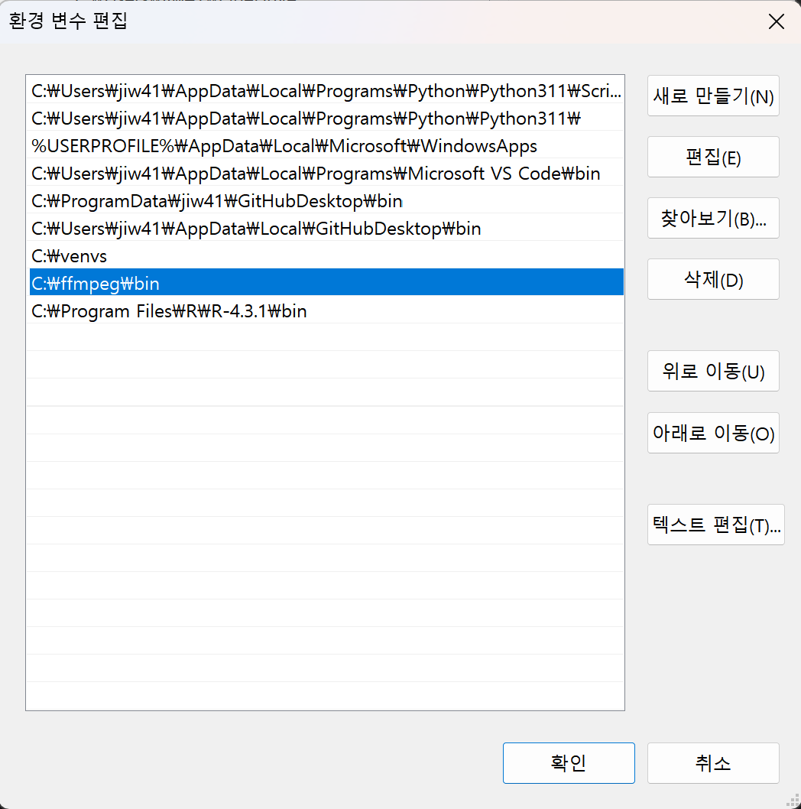
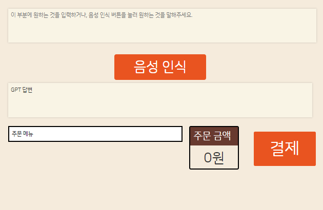

    
    
    

### ASAP Project (칠공주파)

**김득호 • 남동균 • 박찬영 • 이승재 • 정인우 • 정진환 • 차상민**

---

  

# Introduction
ASAP(AI Selection Assistant Program)은 음식점 특화 대화형 서비스 모델 입니다. 현재는 버거킹에 맞게 개발되어 있으며, 향후 다양한 브랜드와 소규모 매장에서도 쉽게 적용할 수 있도록 하는 것이 목표입니다.

  

# 실행하기

1. 모듈 설치  

~~~
...(your path)\ASAP_Project\Web> pip install -r requirements.txt
~~~
pip 명령어로 필요한 모듈들을 설치한다.

requirements.txt파일을 사용해서 한번에 설치할 수 있다.

 

2. bert-kor-base.pth 파일 받기

[파일 받기](https://drive.google.com/file/d/1M-GYoTIh20dRwwSBajsdHrWA_IspFXT4/view?usp=sharing)

설치 경로 : `...(your path)/ASAP_Project/Web/Model/Ko_Bert`

 

3. ffmpeg 압축파일을 받기

[파일 받기](https://drive.google.com/file/d/1mFAcsd0tf1K3IMPpI-E1fX29cHy71672/view?usp=sharing)

* window 기준

시스템 속성 > 환경 변수 > 사용자 변수 > Path 편집 > 새로 만들기 > ffmpeg\bin 경로 생성

압축파일을 푼 뒤 해당 ffmpeg\bin 폴더의 경로를 환경 변수로 등록한다.

 

4. 모델 적용

makemigrations와 migrate 명령어를 통해 모델을 적용한다.

~~~
...(your path)\ASAP_Project\Web> python manage.py makemigrations
~~~

~~~
...(your path)\ASAP_Project\Web> python manage.py migrate
~~~

모델 적용 이후 데이터들을 저장한다.

insertData.py 파일에 적용된 함수들을 사용하면 편하게 저장할 수 있다.

~~~
...(your path)\ASAP_Project\Web> python manage.py shell

>>> from mains.models import BurgerTable, SideTable, DDTable
>>> from mains import insertData as d
>>> d.insert_Menu()
>>> d.insert_Side()
>>> d.insert_DDTable()
>>> 
~~~

 

5. 실행하기

~~~
...(your path)\ASAP_Project\Web> python manage.py runserver
Watching for file changes with StatReloader
Performing system checks...

System check identified no issues (0 silenced).
August 24, 2023 - 10:09:16
Django version 4.2.4, using settings 'config.settings'
Starting development server at http://127.0.0.1:8000/
Quit the server with CTRL-BREAK.
~~~

runserver 명령어를 실행한 후 위와같이 출력되면 성공이다.

`Ctrl`을 누른 상태로 출력된 링크룰 클릭하면 ASAP 홈으로 들어갈 수 있다.

  

# 기술 설명
### - Whisper

  

### - KoNLPy

  

### - kobert

 

  

# References
- [OpenAI Documentation](https://platform.openai.com/docs)
- [fine-tuning 사용법](https://domdom.tistory.com/604)