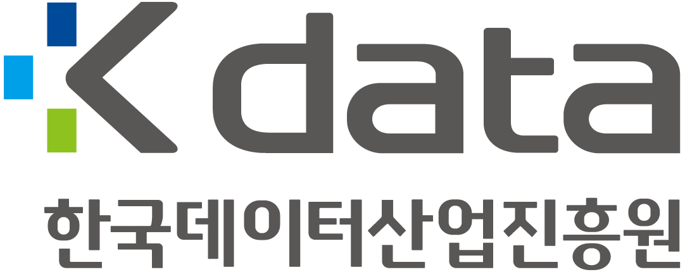

    
    
    

### ASAP Project (칠공주파)

**김득호 • 남동균 • 박찬영 • 이승재 • 정인우 • 정진환 • 차상민**

---

  

# Introduction
ASAP(AI Selection Assistant Program)은 음식점 특화 대화형 서비스 모델 입니다. 현재는 버거킹에 맞게 개발되어 있으며, 향후 다양한 브랜드와 소규모 매장에서도 쉽게 적용할 수 있도록 하는 것이 목표입니다.

  

# 개발 환경

* Django

  

# 기술 설명
### - STT

  

### - Modeling

  

### - Web

  

# References
- [Django REST Framework 강의](https://www.youtube.com/watch?v=1qiQkKshMUs&list=PLQFurmxCuZ2Qmcl0TJame_N79kP2o7VzG&index=1)
- [OpenAI Documentation](https://platform.openai.com/docs)
- [fine-tuning 사용법](https://domdom.tistory.com/604)